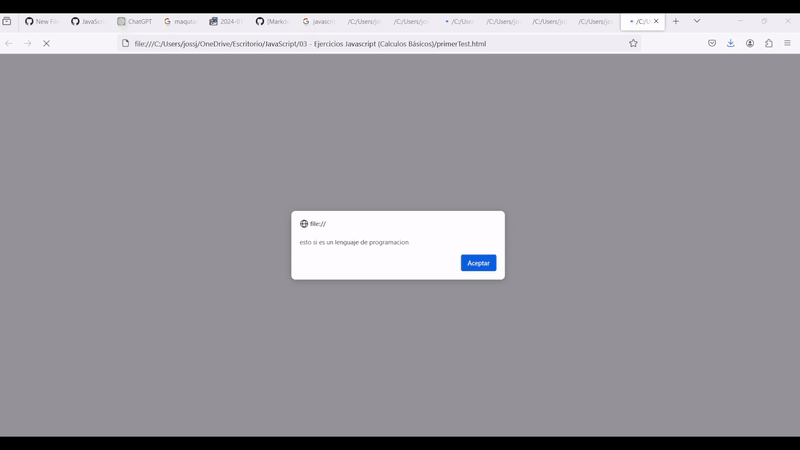

## Javascript 🚀 Portfolio - José Juan Irene Cervantes
[Click aquí para ver la versión en español de la documentación](README_ES.md)

Greetings to code enthusiasts! This repository houses a collection of JavaScript projects ranging from basic concepts to more advanced applications. Each project represents a step on the path to learning and mastering JavaScript.

---

## Main Projects

### 01 - Javascript Basics (My first JavaScript course)

- **Description:** This project marks the start of my journey with JavaScript, where I explored the fundamental concepts of this programming language.

### 02 - Javascript Exercises (Key Concepts)

- **Description:** A series of practical exercises focusing on the key concepts of JavaScript. Here I worked on consolidating my understanding of the language's foundations.

### 03 - Javascript Exercises (Basic Calculations)

- **Description:** More exercises, this time focusing on basic calculations and mathematical operations with JavaScript. Fundamental practice to develop problem-solving skills.

### 04 - Animations and Games in JavaScript

- **Description:** Project dedicated to exploring JavaScript's capabilities to create animations and interactive games. A glimpse into the fun side of programming.

### 05 - To Do List (DOM Manipulation and Modularization)

- **Description:** A task list application that focuses on DOM manipulation and code modularization. Here, I apply advanced JavaScript concepts to create a functional and organized application.

### 06 - Doguito Petshop (CRUD Async json-server backend)

- **Description:** A project that implements CRUD (Create, Read, Update, Delete) operations using an asynchronous JSON backend with json-server. A step further towards understanding data management and full-stack development.

>[!WARNING]
> ***To test all the projects, just run the .js files in the browser, with the exception of `06 - Doguito Petshop (CRUD Async json-server backend)` and `05 - To Do List (DOM Manipulation and Modularization)`. For project 05, it is necessary to raise the page on a web server and for project 06, you need to follow the next steps:***
>    - Download the folder in zip (recommended) or clone the repository
>    - Unzip the folder if you downloaded it
>    - Run the lista_cliente.html file (it is 100% necessary to do it on a web server due to http protocol rules)
>    - Raise a backend server with the db.json file, I used npm's json-server for this, following these commands in the terminal of the root folder:
~~~
npm install json-server
Set-ExecutionPolicy Unrestricted (you need to run the terminal with administrator permissions to do this)
json-server .\db.json
~~~
And done, that's how I temporarily mounted the page's backend server

>[!IMPORTANT]
> ## Contributions and Contact
> - I'm open to collaborations and suggestions! Feel free to explore, fork, and contribute to this repository.
> - For any questions or comments, please do not hesitate to get in touch at:
> - [LinkedIn](https://www.linkedin.com/in/jossjic/)
> - [Email](mailto:jossjic_03@hotmail.com)
> - **Thank you for visiting and exploring my Javascript project portfolio!**
